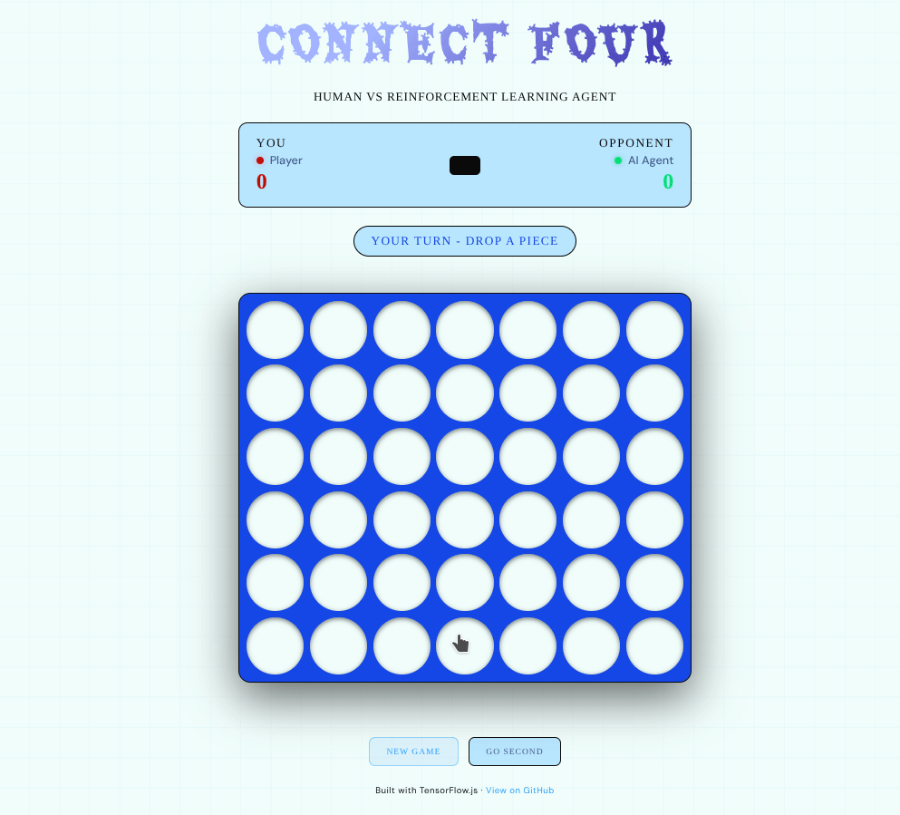

# Connect Four — Deep Reinforcement Learning Agent

> A playable Connect Four AI trained from scratch using Deep Q-Learning (Double DQN) with reward shaping and self-play. Built with TensorFlow and deployed in the browser via TensorFlow.js.

🎮 **[Play it live](https://mnonino.github.io/connect-four-rl)**

---

## Demo



---

## How it works

The agent learns to play Connect Four purely through self-play — it starts knowing nothing and improves by playing thousands of games against itself and random opponents.

### Architecture

The Q-network takes the board state as a `(6, 7, 3)` tensor:
- Channel 0: agent's pieces
- Channel 1: opponent's pieces
- Channel 2: legal move mask

It passes through three convolutional layers followed by two dense layers, and outputs **7 Q-values** — one per column — representing the expected future reward for each possible move.

```
Input (6×7×3)
     ↓
Conv2D → Conv2D → Conv2D
     ↓
  Flatten
     ↓
Dense(256) → Dense(128)
     ↓
Q-values (7)
```

### Double DQN

Standard DQN tends to overestimate Q-values because the same network both *selects* and *evaluates* the best next action. Double DQN separates these two roles:

- The **online network** selects the best next action
- The **target network** evaluates how good that action is

This reduces overestimation bias and leads to more stable, reliable training.

### Reward Shaping

Rather than only rewarding wins and penalising losses, the agent receives intermediate signals that reflect strategic progress:

| Event | Reward |
|---|---|
| Win | `+1.0` |
| Loss | `-1.0` |
| Draw | `+0.2` |
| Own 3-in-a-row | `+0.15` |
| Own 2-in-a-row | `+0.05` |
| Opponent 3-in-a-row | `-0.20` |
| Opponent 2-in-a-row | `-0.08` |

The strong penalty for letting the opponent build a 3-in-a-row (`-0.20`) was key to teaching the agent to **block threats** rather than play passively.

---

## Training journey

Getting a working agent required several iterations — each one teaching something new about RL in practice.

### Attempt 1 — AlphaZero-style MCTS
The first approach followed the AlphaZero paper: a policy+value network guided by Monte Carlo Tree Search (MCTS) and trained via self-play. In theory, MCTS produces very high-quality training data. In practice, each MCTS simulation requires dozens of individual model calls — with batch size 1, the GPU overhead made this prohibitively slow. After reducing simulations from 50 to 10 per move to speed things up, the training signal became too noisy and the agent barely improved beyond random play.

**Lesson learned:** MCTS needs sufficient simulations per move to produce meaningful policy targets. Cutting simulations to speed up training undermines the very thing that makes MCTS work.

### Attempt 2 — Vanilla DQN
Switching to DQN removed the MCTS bottleneck entirely. However, the first DQN run suffered from a subtle but critical bug: both the agent's *and* the opponent's moves were being stored in the replay buffer. Since the board state is always encoded from the current player's POV, storing both players' transitions gave the network completely contradictory signals — the same board position appeared as both "good" and "bad" depending on whose turn it was. The agent couldn't learn anything meaningful.

A second issue was epsilon decay: with `EPSILON_DECAY = 0.997`, epsilon hit its floor around episode 1050. The agent had barely explored before being forced to act greedily on what it had learned — which was almost nothing. Win rate collapsed from ~70% to ~10% as soon as epsilon dropped.

**Lessons learned:** only store the agent's transitions; and decay epsilon slowly enough to allow genuine exploration.

### Attempt 3 — Double DQN + reward shaping + self-play
The final version addressed all previous issues:

- **Double DQN** to reduce Q-value overestimation
- **Reward shaping** to teach blocking and threat-building, not just winning
- **50% self-play** for the opponent (vs 0% before) to expose the agent to stronger positions
- **Slower epsilon decay** (`EPSILON_DECAY = 0.9997` over 15,000 episodes)
- **Only agent transitions stored** in the replay buffer

This produced a stable, genuinely learning agent.

### Results

| Episode | Win Rate | ε |
|---|---|---|
| 500 | 82% | 0.861 |
| 2500 | 94% | 0.472 |
| 6000 | 92% | 0.165 |
| 10000 | 92% | 0.050 |
| 15000 | 88% | 0.050 |

Final win rate vs mixed opponent (50% random, 50% self-play): **~85% average** across the last 5,000 episodes.

---

## Project structure

```
connect-four-rl/
├── index.html                  # Playable web frontend (TensorFlow.js)
├── tfjs_model/
│   ├── model.json              # Exported model architecture
│   └── group1-shard1of1.bin    # Model weights
├── assets/
│   ├── demo.gif                # Gameplay recording
│   └── training_curves.png     # Loss + win rate + epsilon plots
└── notebook/
    └── connect_four_rl.ipynb   # Full training notebook (Google Colab)
```

---

## Run locally

No installation needed — just serve the folder over HTTP:

```bash
git clone https://github.com/mnonino/connect-four-rl
cd connect-four-rl
python -m http.server 8000
```

Then open `http://localhost:8000` in your browser.

---

## Tech stack

- **TensorFlow 2.19** — model definition and training
- **TensorFlow.js 4.15** — in-browser inference (no server needed)
- **Google Colab** — training environment
- **GitHub Pages** — free static hosting

---

## What I'd improve next

- **Prioritised Experience Replay** — sample transitions that the agent got wrong more often, rather than uniformly at random
- **Dueling DQN** — separate the value of a state from the advantage of each action, which helps in positions where the choice of move doesn't matter much
- **Longer training** — 50,000+ episodes with curriculum learning (start easy, increase difficulty gradually)
- **Stockfish-style evaluation** — benchmark against a minimax solver with known ELO rather than just a random opponent

---

*Built as a portfolio project exploring deep reinforcement learning from scratch.*
